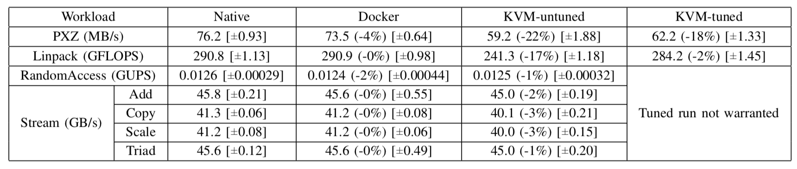

# TryDocker

This repository helps me to learn Docker. It contains some examples, which could be useful to beginners.

## Why Docker?

There are a few technologies and/or softwares to be compared as follows:

- **[Docker](https://www.docker.com)**: a container-based virtualization solution that helps to develop, deploy and run application seamlessly. A container provides an independent environment to run an application, but under the same operating system. It takes almost no more resource than running the application natively. The diagrams below are taken from a research [paper](https://domino.research.ibm.com/library/cyberdig.nsf/papers/0929052195DD819C85257D2300681E7B/$File/rc25482.pdf) from IBM.
	- CPU performance tested using [LINPACK](http://www.netlib.org/linpack/) 
	
	- Sequential I/O throughput 
	
- Virtual Machine (VM): 

## Writing `Dockerfile`

Below are some tips for writing a `Dockerfile` with best practices:

- Do not include irrelevant files (_or libraries, tools_) inside the build context (the working directory when running the `docker build` command). This will result in a larger image size.
- Use a `.dockerignore` file to exclude those irrelevant files.
- 

## Acknowledgements

- [Docker Official Documentation](https://docs.docker.com)
	- [Best practices for writing Dockerfiles](https://docs.docker.com/develop/develop-images/dockerfile_best-practices/)
- [An Updated Performance Comparison of Virtual Machines and Linux Containers](https://domino.research.ibm.com/library/cyberdig.nsf/papers/0929052195DD819C85257D2300681E7B/$File/rc25482.pdf)

## Licence

[GNU General Public Licence 3.0](LICENSE)
